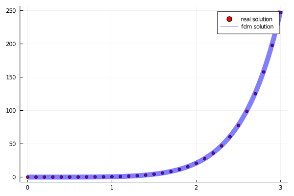
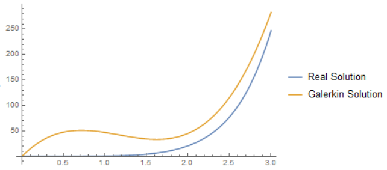
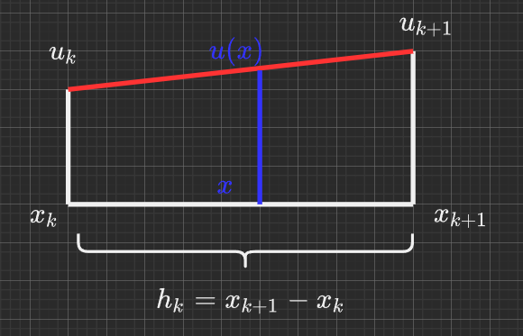
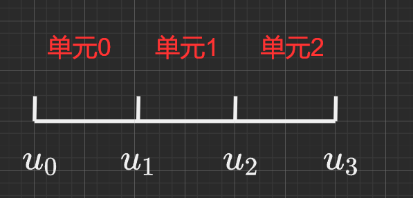

<h1>一维问题的有限元伽辽金解法</h1>

[toc]

# 0.问题的引入

虽然说Galerkin法非常好用，但在面对更加复杂的问题时未免捉襟见肘，精度不够。在整个计算域上用一个函数表达式来进行描述固然很方便，但带来的问题会有精度上的不足，而且解得最终效果也很依赖于基函数的选取。

那一个很自然的想法：**能否将整个区域分成小块，在小块上进行一些基函数近似。**

为了讨论这个问题，我们设想一个线性微分算子$A$（如$\frac{d^2}{dx^2}+3\frac{d}{dx}$），对于方程$Au=f$而言，我们展开如下的讨论。

# 1.直觉中的FDM解法

早在学习高等数学的时候，我就想着人们完全可以用差分来替代微分以获取“精度不那么高的解”。事实是在计算方法这门课程中，也是这么做的。大概的方法就是我们可以根据极限的定义，用差商代替微商：

$$
\lim_{h\to 0}\frac{y(x+h)-y(x)}{h}=y'(x)
$$

实施过程中我们不可能把$h$真的控制为$0$，因此一般只选取较小的步长。

我们来考虑一个横跨$[a,b]$区间的微分方程$y'=f$的数值解：

首先将区间划分为$n$份，步长$h=\frac{b-a}{n}$，接下来将划分好的区间的$n+a$个节点上标上编号，依次记作$x_0,x_1,x_2\dots,x_n$，有$x_i=x_0+ih$，并将其对应的函数值$y$记作$y_i$。

接下来，我们用泰勒展开，将$y_{i+1}$用$y_i$表示：

$$
y_{i+1}=y_i + y'(x_i)h + \frac{y''(x_i)}{2}h^2 +\frac{y'''(x_i)}{6}h^3\dots
$$

因为在划分时$h$是一个小量，因此高阶项可以近似忽略不计，我们将上式近似表示为：

$$
\frac{y_{i+1}-y_{i}}{h}\approx y'(x_i)=f(x_i)
$$

因此在$y_i$已知的情况下，可以递推得到：

$$
y_{i+1}=y_{i}+f(x_i)h
$$

我们可以来思考一个简单的例子：

$$
y'=x^3 e^x\quad y(0)=0\quad y(3)=?
$$

我们用前述的方法（因为这是很直给的一步一步向前迭代计算的方法，因此称为前进欧拉法）进行测试，如代码`Chapter2-1DGalerkin//code//Euler.jl`所述：

```julia
# Chapter2-1DGalerkin//code//Euler.jl
function EulerForward(a, b, y0, f, devide=1000)
    h = (b - a) / devide;
    x = collect(a: h: b);
    y = zeros(devide + 1);
    y[1] = y0;
    for i = 2 : devide+1
        y[i] = y[i-1] + f(x[i]) * h;
    end
    return x, y;
end
```

显然这个方程是有显示解的，我们表示出来并和上述数值解进行比照：

$$
y(x) = (x^3-3x^2+6x-6)e^{x}+6
$$

将比较程序列出，如下：

```julia
# Chapter2-1DGalerkin//code//test.ipynb
using Plots;
include("Euler.jl");

a = 0.;
b = 3.;
y0 = 0;
devide = 300;
h = (b-a)/devide

function f_origin(x)
    y = (x^3 - 3*x^2 + 6*x - 6) * exp(x) + 6;
    return y;
end

function f(x)
    y = exp(x) * x^3;
    return y;
end

xreal = collect(a: h: b);
yreal = f_origin.(xreal);

xnumer, ynumer = EulerForward(a, b, y0, f, devide)

plot(xreal, yreal, lw=10, label="real solution", alpha=0.5)
plot!(xnumer, ynumer, lw=3, label="numerical solution")
savefig("..//image//fdm_example.png")
```



可以发现两个解是相似的。虽然到后面因为$e^x$形式函数增长很快，两条曲线逐渐有差别，但在有限范围内，两条函数曲线吻合得比较好。

# 2.我们能用Galerkin法求解上述问题吗？

FDM已经提供了一个相当直观而且简单有效的微分方程解法了，但我们的重点还是在Galerkin上，我们关注如果用伽辽金法的思想，应该怎么处理这个问题。

如果是一般的伽辽金法，我们该如何操作呢？显然这个时候如果把眼光放在全局，在$[0,3]$区间上进行全局的伽辽金法求解，那么解可能是惨不忍睹的。不妨来试一下：

假设一系列的基函数，取满足条件边界条件的三次函数形式：

$$
\tilde{y} = a_1 x + a_2 x^2 + a^3 x^3
$$

按照前文所述的，记：

$$
H(F) = \int_0^3 F(x)dx
$$

记$f(x)=x^3 e^x$，$\phi_j=x^j,j=1,2,3$。则可以列出方程：

$$
\begin{bmatrix}
H(\phi_1 \phi_1') & H(\phi_1 \phi_2') & H(\phi_1 \phi_3')\\
H(\phi_2 \phi_1') & H(\phi_2 \phi_2') & H(\phi_2 \phi_3')\\
H(\phi_3 \phi_1') & H(\phi_3 \phi_2') & H(\phi_3 \phi_3')
\end{bmatrix}
\begin{bmatrix}
a_1\\a_2\\a_3
\end{bmatrix}=
\begin{bmatrix}
H(f\phi_1)\\H(f\phi_2)\\H(f\phi_3)
\end{bmatrix}
$$

计算过程在`1DGalerkin.nb`中，计算结果如下图所示：



显然Galerkin解和真实解相去甚远——因此我们用一个补救的措施：将区间划分成小段，在每个小段上使用Galerkin法。

# 3.小段上的伽辽金法研究

让我们来考察一个微小的区间$[x_k,x_{k+1}]$，记步长为$h_k=x_{k+1}-x_k$。假定在$x_k$点上，方程$Au=f$的解为$u_k$，在$x_{k+1}上解为$$u_{k+1}$，这样的一个区间被称作一个一维单元。如图：



在小段上，我们不需要给太过复杂的局部表达式，只需要给出一个基础的线性插值函数即可。在这里有边界条件：

$$
u(x_k)=u_k\quad u(x_{k+1})=u_{k+1}
$$


因此此时在该小段上的线性插值应该表示为（波浪上标表示伽辽金插值解）：

$$
\tilde{u}(x) = \frac{x_{k+1}-x}{h_k}u_{k}+\frac{x-x_k}{h_k}u_{k+1}
$$

记：

$$
\begin{cases}
\phi_{0}^k(x) &= \frac{x_{k+1}-x}{h_k}\\
\phi_{1}^{k}(x) &= \frac{x-x_k}{h_k}
\end{cases}
$$

显然有：

$$
\frac{d\phi_0^k}{dx} =-\frac{d\phi_1^k}{dx} =-\frac{1}{h_k}
$$

于是可以记作：

$$
\tilde{u}(x) = \phi_0^k u_k + \phi_1^k u_{k+1}\quad x_k\leq x\leq x_{k+1}
$$

我们将$\phi_0^k$和$\phi_1^k$视作基函数，并在这个小单元上对其进行Galerkin类似的分析。

$$
\int_{x_k}^{x_{k+1}}(A\tilde{u}-f)\phi_j^k dx=0\quad j=0,1
$$

同样记：

$$
H_k(f)=\int_{x_k}^{x_{k+1}}f(x)dx
$$

将上述改写为矩阵乘法形式：

$$
\begin{bmatrix}
H_k(\phi_0^k A\phi_0^k) & H_k(\phi_0^k A\phi_1^k)\\
H_k(\phi_1^k A\phi_0^k) & H_k(\phi_1^k A\phi_1^k)
\end{bmatrix}
\begin{bmatrix}
u_{k}\\u_{k+1}
\end{bmatrix}=
\begin{bmatrix}
H_k(f\phi_0^k)\\ H_k(f\phi_1^k)
\end{bmatrix}
$$

但是**注意**，先别急着对上述矩阵求逆，因为**这只是一个单元而已**——要想获得最终的大方程，必须要考虑**所有小微段**对整个方程进行组装。

# 4.以四节点为例展示矩阵组装

为方便书写，进行如下标记：

$$
\begin{cases}
\begin{aligned}
& H_k(\phi_i^k A\phi_j^k) = A_{ij}^k\quad i,j\in \{1,0\}\\
& H_k(f\phi_i^k)=b^k_i\quad i=0,1
\end{aligned}
\end{cases}
$$

我们可以来理解一下上述表达的含义：

$A_{ij}^k$表示$k$号单元（区间）上，节点$j$对节点$i$处的“贡献”。

$b_i^k$表示$k$号单元（区间）上，节点$i$所得的“贡献值”。

我们考虑将区间分成三段四节点的形式：



我们考虑$u_1$这个点，这个点横跨两个单元，即单元$0$和单元$1$。

1. 在单元$0$上，节点$0$上的$u_0$对$u_1$有贡献$A^0_{10}u_0$，节点$1$上的$u_1$对自身也有贡献$A^0_{11}u_1$。

2. 在单元$1$上，节点$1$上的$u_1$对自身有贡献$A^1_{00}u_1$，节点2上的$u_2$对自身也有贡献$A^1_{01}u_2$。

3. 而$u_1$处总贡献值由两侧单元提供，为$b^0_1+b^1_0$。其中$b^0_1$表示单元$0$给节点$1$提供的总贡献值，$b^1_0$表示单元$1$对节点$1$的总贡献值。

于是针对节点$1$可以列出如下方程：

$$
A^0_{10}u_0 + (A_{11}^0+A^1_{00})u_1 + A_{01}^1 u_2 = b^0_1+b^1_0
$$

对每个节点进行方程拼装，得到最终的矩阵形式方程$Au=b$：

$$
\begin{bmatrix}
A^0_{00} & A^0_{01} & 0 & 0\\
A^0_{10} & A^0_{11} + A^1_{00} & A^1_{01} & 0\\
0 & A^1_{10} & A^1_{11}+A^2_{00} & A^2_{01}\\
0 & 0 & A^2_{10} & A^2_{11}
\end{bmatrix}
\begin{bmatrix}
u_0 \\ u_1 \\ u_2 \\ u_3
\end{bmatrix}=
\begin{bmatrix}
b^0_0 \\ b^0_1+b^1_0 \\ b^1_1 + b^2_0 \\ b^2_1
\end{bmatrix}
$$

若节点更多，单元数量更多，按照类似方法进行矩阵拼装，最终能得到一个“鸡爪型”的$A$矩阵。此刻再配合上$u_0$的初始边界条件，可以一行一行消去求解该线性方程组。

# 5.积分换元

显然，因为每一个单元的$x_k$与区间步长不一致，因此每个单元上的基函数$\phi^k_j(j=0,1)$是不尽相同的。对于每个不同的积分单元，我们可以尝试着寻找一些积函数的共性进行分析。

考虑如下换元：

$$
\xi=\frac{x-x_k}{h_k}\quad h_k d\xi = dx
$$

因此可以如下表示：

$$
\begin{cases}
\begin{aligned}
\phi^k_0 &= 1-\xi\\
\phi^k_1 &= \xi
\end{aligned}
\end{cases}
$$

所以：

$$
\begin{aligned}
H_k(\phi^k_i A \phi^k_j) &= \int_{x_k}^{x_{k+1}}\phi^k_i A \phi^k_jdx\\
&=h_k\int_0^1 \phi^k_i A \phi^k_j d\xi
\end{aligned}
$$

$$
\begin{aligned}
H_k(f\phi^k_j)&=\int_{x_k}^{x_{k+1}}f(x)\phi_j^kdx\\
&=h_k\int_0^1   f(h_k\xi + x_k) \phi_j^k d\xi
\end{aligned}
$$

这里的$\phi_j^k$是$\xi$与$1-\xi$，因此在微分算子$A$已知时，$H_k(\phi^k_i A \phi^k_j)$往往可以显示表示。而$f$往往没有显示的积分表达式（不然这个微分方程就直接解出来了），因此在$h_k$较小的前提下，我们可以利用[Simpson公式](https://blog.csdn.net/qq_32708325/article/details/84258964)或者只用简单的梯形公式进行近似：

$$
\begin{aligned}
H_k(f\phi^k_0)&\approx \frac{h_k}{6}\left[ f(x_k) + 2f\left(x_{k}+\frac{h_k}{2}\right)\right]\\
H_k(f\phi^k_1)&\approx \frac{h_k}{6}\left[ 2f\left(x_{k}+\frac{h_k}{2}\right) + f(x_{k+1})\right]
\end{aligned}
$$

