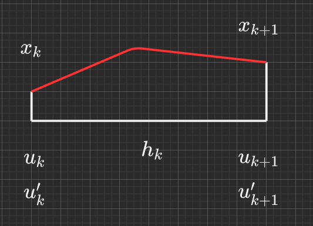

<h1>一维Hermite插值与求解</h1>

[toc]

# 0.直觉的由来

在划分单元伽辽金法求解结束后，事实上各段的最终函数值都是一条直线——由单元两端函数值控制的直线。这在网格及其细密的时候是很好用的，但是单元内函数呈线性变化，且单元间两条直线斜率不一样会产生“折角”，这对于真实函数的逼近无疑是有害的。

能否在进行插值的时候，添加一些限制，从而使得左单元与右单元相拼接的时候，其若干阶导数值也是相同的？这就要求插值时添加条件。

联想到对于离散函数点进行插值的过程，其中的**样条插值**方法就要求其导数具有平滑性，因此三次样条，即三弯矩方程是最为广泛使用的（即二阶导能对的上）。

那在伽辽金法中能否也进行类似的处理呢？

# 1.单元上的插值过程

我们仍然考虑一个横跨$[x_k,x_{k+1}]$的一个小单元，记$h_k=x_{k+1}-x_{k}$。记$u(x)$在点$x_k$上的值与导数值为$u_k,u_k'$。如下图所示：

设想一个三次函数满足该单元上的边界条件：

$$
\tilde{u}(x)= a_0 + a_1 x + a_2 x^2 + a_3 x^3=
\begin{bmatrix}
1 & x & x^2 & x^3
\end{bmatrix}
\begin{bmatrix}
a_0\\a_1\\a_2\\a_3
\end{bmatrix}
$$

有：

$$
\frac{d\tilde{u}}{dx} = 
\begin{bmatrix}
0 & 1 & 2x & 3x^2
\end{bmatrix}
\begin{bmatrix}
a_0\\a_1\\a_2\\a_3
\end{bmatrix}
$$

于是我们可以据此单元边界条件列出矩阵方程：

$$
\begin{bmatrix}
1 & x_k & x_k^2 & x_k^3\\
0 & 1 & 2x_k & 3x_k^2\\
1 & x_{k+1} & x_{k+1}^2 & x_{k+1}^3\\
0 & 1 & 2x_{k+1} & 3x_{k+1}^2
\end{bmatrix}
\begin{bmatrix}
a_0\\a_1\\a_2\\a_3
\end{bmatrix}=
\begin{bmatrix}
u_k\\ u_k'\\ u_{k+1}\\ u_{k+1}'
\end{bmatrix}
$$

于是$\tilde{u}(x)$可以表示为：

$$
\tilde{u}(x) = 
\begin{bmatrix}
1 & x & x^2 & x^3
\end{bmatrix}
\begin{bmatrix}
1 & x_k & x_k^2 & x_k^3\\
0 & 1 & 2x_k & 3x_k^2\\
1 & x_{k+1} & x_{k+1}^2 & x_{k+1}^3\\
0 & 1 & 2x_{k+1} & 3x_{k+1}^2
\end{bmatrix}^{-1}
\begin{bmatrix}
u_k\\ u_k'\\ u_{k+1}\\ u_{k+1}'
\end{bmatrix}
$$

进行如下换元：

$$
\begin{cases}
\begin{aligned}
x_{k+1} &= x_k + h_k\\
x & = h_k \xi + x_k
\end{aligned}
\end{cases}
$$

于是上述式子结合前两个矩阵相乘，可以写作：

$$
\tilde{u}(\xi)=
\begin{bmatrix}
1-3\xi^2+2\xi^3 &
h_k(\xi - 2\xi^2) &
3\xi^2-2\xi^3 &
h_k(-\xi^2 + \xi^3)
\end{bmatrix}
\begin{bmatrix}
u_k\\ u_k'\\ u_{k+1}\\ u_{k+1}'
\end{bmatrix}
$$

此时：

$$
\frac{d^p w}{d x^p} = \frac{1}{h_k^p}\frac{d^p w}{d\xi^p} 
$$

仍然考虑$Au=f$的方程，仍然记$H_k(f)=\int_{x_k}^{x_{k+1}}f(x)dx$，做如下记号：

$$
\begin{cases}
\begin{aligned}
\phi^k_{00} &= 1-3\xi^2+2\xi^3\\
\phi^k_{01} &= h_k(\xi - 2\xi^2)\\
\phi^k_{10} &= 3\xi^2-2\xi^3\\
\phi^k_{11} &= h_k(-\xi^2 + \xi^3)
\end{aligned}
\end{cases}
$$

在该单元上需要进行四次积分操作：

$$
H_k[(A\tilde{u}-f)\phi^k_{ij}]=0\quad i,j\in\{0,1\}
$$

$$
\begin{bmatrix}
H_k(\phi^k_{00}A\phi^k_{00}) & H_k(\phi^k_{00}A\phi^k_{01}) & H_k(\phi^k_{00}A\phi^k_{10}) & H_k(\phi^k_{00}A\phi^k_{11})\\
H_k(\phi^k_{01}A\phi^k_{00}) & H_k(\phi^k_{01}A\phi^k_{01}) & H_k(\phi^k_{01}A\phi^k_{10}) & H_k(\phi^k_{01}A\phi^k_{11})\\
H_k(\phi^k_{10}A\phi^k_{00}) & H_k(\phi^k_{10}A\phi^k_{01}) & H_k(\phi^k_{10}A\phi^k_{10}) & H_k(\phi^k_{10}A\phi^k_{11})\\
H_k(\phi^k_{11}A\phi^k_{00}) & H_k(\phi^k_{11}A\phi^k_{01}) & H_k(\phi^k_{11}A\phi^k_{10}) & H_k(\phi^k_{11}A\phi^k_{11})
\end{bmatrix}
\begin{bmatrix}
u_k\\ u_k'\\ u_{k+1}\\ u_{k+1}'
\end{bmatrix}=
\begin{bmatrix}
H_k(f\phi^k_{00})\\
H_k(f\phi^k_{01})\\
H_k(f\phi^k_{10})\\
H_k(f\phi^k_{11})
\end{bmatrix}
$$

我们考虑$A$为一个二阶常微分线性算子如下：

$$
\begin{aligned}
A&=p\frac{d^2}{dx^2} + q\frac{d}{dx} + r\\
&=\frac{p}{h_k^2}\frac{d^2}{d\xi^2} + \frac{q}{h_k}\frac{d}{d\xi} + r
\end{aligned}
$$

记矩阵$A^{k}=[H_k(\phi^k_{il}A\phi^k_{mj})]\quad i,l,m,j\in\{0,1\}$，在算子$A$的作用下并积分，得到$A^k$：

$$
A^k=
\begin{bmatrix}
 -\frac{6 p}{5 h_k}+\frac{13 h_k r}{35}-\frac{q}{2} & \frac{11 h_k^2 r}{210}+\frac{h_k q}{10}-\frac{11 p}{10} & \frac{6 p}{5 h_k}+\frac{9 h_k r}{70}+\frac{q}{2} & -\frac{1}{420} 13 h_k^2 r-\frac{h_k q}{10}-\frac{p}{10} \\
 \frac{11 h_k^2 r}{210}-\frac{h_k q}{10}-\frac{p}{10} & \frac{h_k^3 r}{105}-\frac{2 h_k p}{15} & \frac{13 h_k^2 r}{420}+\frac{h_k q}{10}+\frac{p}{10} & -\frac{h_k^3 r}{140}-\frac{h_k^2 q}{60}+\frac{h_k p}{30} \\
 \frac{6 p}{5 h_k}+\frac{9 h_k r}{70}-\frac{q}{2} & \frac{13 h_k^2 r}{420}-\frac{h_k q}{10}+\frac{p}{10} & -\frac{6 p}{5 h_k}+\frac{13 h_k r}{35}+\frac{q}{2} & -\frac{1}{210} 11 h_k^2 r+\frac{h_k q}{10}+\frac{11 p}{10} \\
 -\frac{1}{420} 13 h_k^2 r+\frac{h_k q}{10}-\frac{p}{10} & -\frac{h_k^3 r}{140}+\frac{h_k^2 q}{60}+\frac{h_k p}{30} & -\frac{1}{210} 11 h_k^2 r-\frac{h_k q}{10}+\frac{p}{10} & \frac{h_k^3 r}{105}-\frac{2 h_k p}{15} 
\end{bmatrix}
$$

同理在$H_k(f\phi^k_{ij})$中考虑Simpson积分：

$$
\begin{cases}
\begin{aligned}
H_k(f\phi^k_{00}) &= h_k\int_0^1 f(x_k+\xi h_k)(1-3\xi^2+2\xi^3)d\xi\approx \frac{h_k}{6}\left[ f(x_k) + 2f(x_k+\frac{h_k}{2}) \right]\\
H_k(f\phi^k_{01}) &= h_k^2\int_0^1 f(x_k+\xi h_k)(\xi-2\xi^2)d\xi\approx \frac{h_k^2}{12}f(x_k+\frac{h_k}{2})\\
H_k(f\phi^k_{10}) &= h_k\int_0^1 f(x_k+\xi h_k)(3\xi^2-2\xi^3)d\xi\approx \frac{h_k}{6}\left[  2f(x_k+\frac{h_k}{2})+f(x_{k+1}) \right]\\
H_k(f\phi_{11}^k) &= h_k\int_0^1 f(x_k+\xi h_k)(-\xi^2+\xi^3)d\xi\approx -\frac{h_k^2}{12}f(x_k+\frac{h_k}{2})
\end{aligned}
\end{cases}
$$

于是对于单元$k$而言，其局部的方程组就为：

$$
\begin{bmatrix}
 -\frac{6 p}{5 h_k}+\frac{13 h_k r}{35}-\frac{q}{2} & \frac{11 h_k^2 r}{210}+\frac{h_k q}{10}-\frac{11 p}{10} & \frac{6 p}{5 h_k}+\frac{9 h_k r}{70}+\frac{q}{2} & -\frac{1}{420} 13 h_k^2 r-\frac{h_k q}{10}-\frac{p}{10} \\
 \frac{11 h_k^2 r}{210}-\frac{h_k q}{10}-\frac{p}{10} & \frac{h_k^3 r}{105}-\frac{2 h_k p}{15} & \frac{13 h_k^2 r}{420}+\frac{h_k q}{10}+\frac{p}{10} & -\frac{h_k^3 r}{140}-\frac{h_k^2 q}{60}+\frac{h_k p}{30} \\
 \frac{6 p}{5 h_k}+\frac{9 h_k r}{70}-\frac{q}{2} & \frac{13 h_k^2 r}{420}-\frac{h_k q}{10}+\frac{p}{10} & -\frac{6 p}{5 h_k}+\frac{13 h_k r}{35}+\frac{q}{2} & -\frac{1}{210} 11 h_k^2 r+\frac{h_k q}{10}+\frac{11 p}{10} \\
 -\frac{1}{420} 13 h_k^2 r+\frac{h_k q}{10}-\frac{p}{10} & -\frac{h_k^3 r}{140}+\frac{h_k^2 q}{60}+\frac{h_k p}{30} & -\frac{1}{210} 11 h_k^2 r-\frac{h_k q}{10}+\frac{p}{10} & \frac{h_k^3 r}{105}-\frac{2 h_k p}{15} 
\end{bmatrix}
\begin{bmatrix}
u_k\\ u_k'\\ u_{k+1}\\ u_{k+1}'
\end{bmatrix}=
\begin{bmatrix}
\frac{h_k}{6}\left[ f(x_k) + 2f(x_k+\frac{h_k}{2}) \right]\\
\frac{h_k^2}{12}f(x_k+\frac{h_k}{2})\\
\frac{h_k}{6}\left[  2f(x_k+\frac{h_k}{2})+f(x_{k+1}) \right]\\
-\frac{h_k^3}{12}f(x_k+\frac{h_k}{2})
\end{bmatrix}
$$

两边同乘$12h_k$化简为：

$$
\begin{bmatrix}
 \frac{156 h_k^2 r}{35}-6 h_k q-\frac{72 p}{5} & \frac{22 h_k^3 r}{35}+\frac{6 h_k^2 q}{5}-\frac{66 h_k p}{5} & \frac{54 h_k^2 r}{35}+6 h_k q+\frac{72 p}{5} & -\frac{1}{35} 13 h_k^3 r-\frac{6 h_k^2 q}{5}-\frac{6 h_k p}{5} \\
 \frac{22 h_k^3 r}{35}-\frac{6 h_k^2 q}{5}-\frac{6 h_k p}{5} & \frac{4 h_k^4 r}{35}-\frac{8 h_k^2 p}{5} & \frac{13 h_k^3 r}{35}+\frac{6 h_k^2 q}{5}+\frac{6 h_k p}{5} & -\frac{1}{35} 3 h_k^4 r-\frac{h_k^3 q}{5}+\frac{2 h_k^2 p}{5} \\
 \frac{54 h_k^2 r}{35}-6 h_k q+\frac{72 p}{5} & \frac{13 h_k^3 r}{35}-\frac{6 h_k^2 q}{5}+\frac{6 h_k p}{5} & \frac{156 h_k^2 r}{35}+6 h_k q-\frac{72 p}{5} & -\frac{1}{35} 22 h_k^3 r+\frac{6 h_k^2 q}{5}+\frac{66 h_k p}{5} \\
 -\frac{1}{35} 13 h_k^3 r+\frac{6 h_k^2 q}{5}-\frac{6 h_k p}{5} & -\frac{1}{35} 3 h_k^4 r+\frac{h_k^3 q}{5}+\frac{2 h_k^2 p}{5} & -\frac{1}{35} 22 h_k^3 r-\frac{6 h_k^2 q}{5}+\frac{6 h_k p}{5} & \frac{4 h_k^4 r}{35}-\frac{8 h_k^2 p}{5} \\
\end{bmatrix}
\begin{bmatrix}
u_k\\ u_k'\\ u_{k+1}\\ u_{k+1}'
\end{bmatrix}=
h_k^2
\begin{bmatrix}
2f(x_k) + 4f(x_k+\frac{h_k}{2})\\
h_k f(x_k+\frac{h_k}{2})\\
4f(x_k+\frac{h_k}{2}) + 2f(x_{k+1})\\
-h_k f(x_k+\frac{h_k}{2})
\end{bmatrix}
$$

得到局部的矩阵后，最终拼装就可以获取最后的大方程。（程序中在上述过程里两边方程均乘以$35$）。

# 2.一个测试算例

