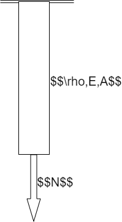
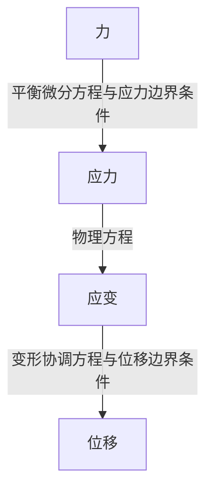
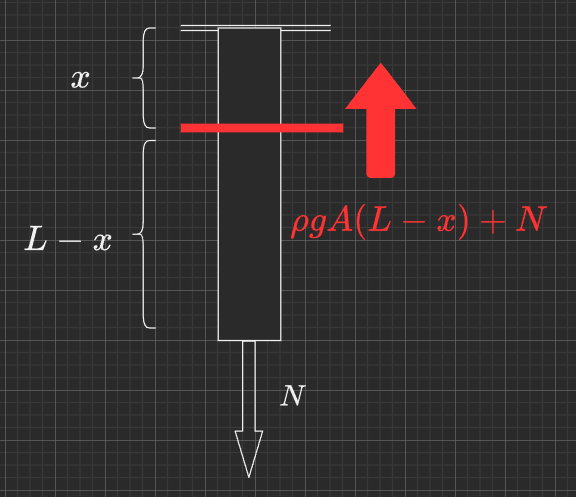
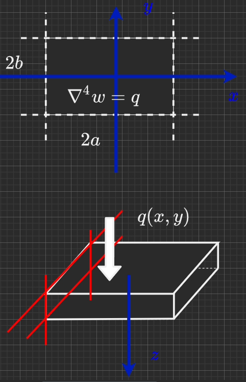
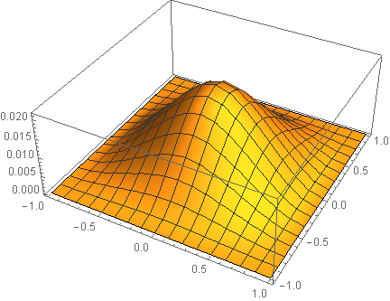

<h1>Galerkin伽辽金法引入</h1>

[toc]

# 0.导言

长久以来，我作为一个本科生在思考究竟什么是我需要追寻的？我应该以什么方式走入科研？这些问题无疑是费神费力的，直到我接触到了《计算方法》这一门课。

早在高等数学的学习中，我就思考人们如何才能计算得到没有解析式的积分。当时的想法很简单，也无非是用梯形法强行分割积分区域，然后暴力累加近似——但《计算方法》这一门课告诉我们有更好的Simpson公式、Cotes公式，乃至于奇怪但精度更高的Gauss积分法。当然数值计算不止于此，有限差分（FDM）是最为直观基础的思考方法。但随着问题维度的升高，或许引入更加丰富的求解思路会更好。

在我看来，数值求解的精髓在于“局部的线性”。当然这个表达必然是错的，但在大部分问题中似乎很管用，我也乐意用这样的想法去进行思考。

这个项目是把我当前所学的一些知识做一个整理，并程序化进行验证求解。因为课题组的要求，我无法直接接触到祖传代码，因此快马先行，早一步自己做一些尝试或许是个不错的选择。

# 1.一个简单的问题

第一次接触Galerkin法是在《弹性力学》这门课中。比较直观的想法是这样的：

1. 我们给出一个满足边界条件的位移场表达式，这个表达式是一系列基函数的线性累加，基函数分别满足边界条件；
2. 根据给出的平衡微分方程，对于每一个基函数在计算区域上的加权积分为零（这是由泛函分析，最小势能原理得到），得到一系列关于加权值的方程；
3. 求解得到加权值，他们和基函数的点积就是在当前函数表达下的最贴近真实解的位移表达式。

我向来觉得理论很抽象，需要从一个例子里体现出具体的步骤，于是我们应该考虑一个例子。

如图所示，一根长$L$的木棍，其容重为$\rho$，弹性模量为$E$，横截面积$A$。将其倒吊在天花板上，并在其底部作用一集中力$N$。这个时候请求出其位移场以及应力场，并给出木棍底端位移表达式。

显然这个问题对于学过材料力学的朋友而言应该没有任何难度，我们只需要简单地建立一个坐标系，并求出各个截面处的内力，再折算为应力，用物理方程求出应变，再将应变做积分就可以得到位移。这是基于**弹性力学**理论的基础解法。

为了验证结论，我们先根据基础的弹性理论进行求解。

由上而下建立$x$轴，位移$u$视作$x$的函数$u(x)$。从上而下在位置为$x$的地方假想地截开一刀。如下图所示：

很显然根据受力分析，将下段进行整体分析，可以得到在距离上端$x$的地方横截面处，有拉力$F(x)$如下：

$$
F(x)=\rho g A(L-x)+N
$$

推知横截面处应力为$\sigma (x)=F(x)/A$：

$$
\sigma (x) = \rho g (L-x) + \frac{N}{A}
$$

单向应力情形，根据物理方程得到应变$E\varepsilon (x) =  \sigma (x)$：

$$
\varepsilon (x) =  \frac{\rho g(L-x)}{E} + \frac{N}{EA}
$$

根据变形协调关系，位移$u = \int \varepsilon dx$，且根据位移边界条件条件，$u(0)=0$，即上端固定端无位移，可以求得位移场：

$$
u(x) = \frac{\left( \rho g L + \frac{N}{A} \right)}{E} x - \frac{\rho g}{2E} x^2
$$

显然下端的位移为：

$$
u(L) = \frac{\rho g L^2}{2E} + \frac{N L}{EA}
$$

我们不妨来尝试理解一下这个解：若$N=0$，即下端拉力为$0$，则：

$$
u(x) = -\frac{\rho g}{2E} x^2 + \frac{\rho gL}{E} x
$$

是一个二次函数解，且显然在$x = -\frac{\rho g L}{-\frac{\rho g}{2} \times 2}=L$处取得最大值，这与物理直觉是一致的，此时$u(L) = \frac{\rho g L^2}{2E}$。

若忽略容重$\rho$，则$u(x) = \frac{N}{EA} x$，这是一个简单的线性拉伸。

因此上述问题的位移场是由一个重力影响下的二次函数解叠加上一个线性拉伸的线性解而成的。

**当然**，这是一个非常理想的状态，我们可以一步一步地用解析的方法，在一些简化假设下（比如这里用到了细长杆件的一些假设），我们才能求解得到最终的解析解。但在一些更加复杂的情形下，上述流程就无法适用了。

# 2.如何使用伽辽金方法求解

让我们回顾一下提及的伽辽金法思路：

1. 我们给出一个满足边界条件的位移场表达式，这个表达式是一系列基函数的线性累加，基函数分别满足边界条件；
2. 根据给出的平衡微分方程，对于每一个基函数在计算区域上的加权积分为零（这是由泛函分析，最小势能原理得到），得到一系列关于加权值的方程；
3. 求解得到加权值，他们和基函数的点积就是在当前函数表达下的最贴近真实解的位移表达式。

对于上述问题而言，我们第一步需要**选取位移函数的基函数**：

这个基函数应该需要满足**位移边界条件**。这里的位移边界条件只有一条：$u(0)=0$。

这样的函数其实有很多，比如$x,x^2,x^3\dots$，再比如$\sin x, 1-\cos x$等。不过这里需要注意的是，选取三角函数时要进行一些无量纲化，如$\sin \frac{x}{L},\sin \frac{2x}{L}\dots$。这里将位移函数表示为**一系列基函数的线性叠加**，不妨以三次函数为例，选取如下基函数：

1. $\phi_1(x) = x$
2. $\phi_2(x) = x^2$
3. $\phi_3(x) = x^3$

$$
u(x) =\sum_{j=1}^{3} a_j\phi_j(x) =a_1 x + a_2 x^2 +a_3 x^3
$$

接下来我们根据微分关系$\frac{du}{dx} = \varepsilon$，可以列出物理方程：

$$
E\frac{du(x)}{dx}-\frac{F(x)}{A} = 0
$$

上式是严格成立的，但是事实上，我们在假设基函数的时候并不确定真实解就一定是我们所表示的函数形式，因此我们可以退而求其次地**要求上述函数与各基函数的内积为$0$**。

这里需要插播一下什么是内积：
> 简单而言，内积可以看成两个同在区域$\Omega$上有定义的函数$f$和$g$相乘后在该区域上的积分$\int _{\Omega} (fg) d \Omega$

具体到上面的问题里，即将$\left( E\frac{du}{dx} - \frac{F}{A} \right)$与$\phi_j$作内积，区域即$x=0\sim L$：

$$
\int_{0}^{L} \left( E\frac{du}{dx} - \frac{F}{A} \right)\phi_j dx = 0\quad (j=1,2,3)
$$

即：

$$
\int_0^{L}\phi_j du = \frac{1}{EA}\int_{0}^{L} F \phi_j dx\quad (j=1,2,3)
$$

因为这里的$u$已经表示清楚了，只需将其带入即可：

$$
\sum_{k=1}^3 a_k \int_{0}^{L} \phi_j d\phi_k = \frac{1}{EA}\int_{0}^{L} F \phi_j dx\quad (j=1,2,3)
$$

很自然地将上述方程写成矩阵形式：

$$
\begin{bmatrix}
\int_{0}^{L}\phi_1d\phi_1 & \int_{0}^{L}\phi_1d\phi_2 &\int_{0}^{L}\phi_1d\phi_3\\
\int_{0}^{L}\phi_2d\phi_1 & \int_{0}^{L}\phi_2d\phi_2 & \int_{0}^{L}\phi_2d\phi_3\\
\int_{0}^{L}\phi_3d\phi_1 & \int_{0}^{L}\phi_3d\phi_2 & \int_{0}^{L}\phi_3d\phi_3
\end{bmatrix}
\begin{bmatrix}
a_1 \\ a_2 \\ a_3
\end{bmatrix}
=\frac{1}{EA}
\begin{bmatrix}
\int_{0}^{L}F\phi_1 dx\\
\int_{0}^{L}F\phi_2 dx\\
\int_{0}^{L}F\phi_3 dx
\end{bmatrix}
$$

带入假设的基函数，可以得到$a_1,a_2,a_3$的值日下：

$$
\begin{cases}
a_1=\frac{N}{EA}+\frac{\rho g L}{E}\\
a_2 = -\frac{\rho g}{2E}\\
a_3 = 0
\end{cases}
$$

也就是：

$$
u(x) = \frac{\left( \rho g AL + N \right)}{EA} x - \frac{\rho g}{2E}x^2
$$

这与前文中用弹性力学方法所求的解是一致的。

# 3.一个复杂二维问题的伽辽金法求解尝试

当然，上面的问题实在是太过简单，我们无法体会到伽辽金法的魅力——因为物理模型太过简单，微分方程有很简单的显示解。这个时候使用伽辽金法未免显得多余。但是，对于没有显示解的物理方程，galerkin解法的魅力就能体现出来了。

让我们来思考一个简单的力学问题：薄板问题。

我们思考一个这样的场景：

一块薄板，四边**固支**。弹性模量$E$，厚度为$t$，泊松比为$\mu$，由此可以计算该板的抗弯刚度$D = \frac{E t^3}{12(1-\mu^2)}$。薄板挠度（即垂直位移$w$）与分布载荷$q$的微分关系为：

$$
\nabla^4 w(x,y) = q(x,y)
$$

考虑$q(x,y)=q_0$为一常值形式加载。我们以板中心位置为中心建立坐标系，根据位移边界条件，在四条边界上有如下的关系：

$$
\frac{\partial w}{\partial x}|_{x=\pm a} =\frac{\partial w}{\partial y}|_{y=\pm b} =w|_{x=\pm a,y=\pm b}= 0,
$$

因此在进行galerkin求解的时候，我们需要先给出满足上述条件的基函数。我们不妨也从三角形式的基函数入手。

考虑如下的基函数形式：

$$
\phi(x,y) = \left[1+\cos\frac{(2m+1)\pi x}{a}\right]\left[1+\cos\frac{(2n+1)\pi y}{b}\right]\quad m,n\in \mathscr{N}
$$

显然在边界处，$\phi(x,y)$满足前述的边界条件。以边界$x=-a$为例，此处$\phi(-a,y)=0$，且$\partial_x \phi(x,y)|_{x=-a}=0$。类似的，在四个固支边上均满足相应的边界条件。

ok现在我们选取三个简单的基函数形式如下：

$$
\begin{cases}
\phi_1(x,y) &=\left(1+\cos\frac{\pi x}{a}\right)\left(1+\cos\frac{\pi y}{b}\right)\\
\phi_2(x,y) &=\left(1+\cos\frac{3\pi x}{a}\right)\left(1+\cos\frac{\pi y}{b}\right)\\
\phi_3(x,y) &=\left(1+\cos\frac{\pi x}{a}\right)\left(1+\cos\frac{3\pi y}{b}\right)
\end{cases}
$$

将挠度函数$w$表示为上述基函数的线性组合：

$$
\tilde{w}(x,y) = \sum_{i=1}^{3} a_i \phi_i
$$

给定积分区域$-a\leq x \leq a,-b\leq y \leq b$。

类似上述步骤考虑如下三个方程：

$$
\int_{-a}^{a}dx\int_{-b}^b \left(  \sum_{k=1}^3 a_k \nabla^4\phi_k - \frac{q_0}{D}\right) \phi_j dy = 0\quad j=1,2,3
$$

记：
$$
\int_{-a}^a\int_{-b}^b f(x,y) dxdy = H(f)
$$

则可以将上述方程组改写为如下矩阵乘法形式：

$$
\begin{bmatrix}
H(\phi_1\nabla^4 \phi_1) & H(\phi_1\nabla^4 \phi_2) & H(\phi_1\nabla^4 \phi_3)\\
 H(\phi_2\nabla^4 \phi_1) & H(\phi_2\nabla^4 \phi_2) & H(\phi_2\nabla^4 \phi_3)\\
 H(\phi_3\nabla^4 \phi_1) & H(\phi_3\nabla^4 \phi_2) & H(\phi_3\nabla^4 \phi_3)
\end{bmatrix}
\begin{bmatrix}
a_1\\a_2\\a_3
\end{bmatrix}
=\frac{q_0}{D}
\begin{bmatrix}
H(\phi_1)\\
H(\phi_2)\\
H(\phi_3)
\end{bmatrix}
$$

利用`introduction.nb`的`mathematica`计算程序可以计算得到如下结果：

$$
\begin{bmatrix}
\frac{\pi^4(3a^4 + 2a^2b^2 + 3b^4)}{a^3 b^3}& \frac{2\pi^4 a}{b^3}& \frac{2\pi^4 b}{a^3}\\
\frac{2\pi^4 a}{b^3}& \frac{3\pi^4(a^4 + 6a^2b^2 + 81b^4)}{a^3b^3} & 0\\
\frac{2\pi^4 b}{a^3}&0&\frac{3\pi^4(81a^4 + 6a^2b^2 + b^4)}{a^3b^3}
\end{bmatrix}
\begin{bmatrix}
a_1\\a_2\\a_3
\end{bmatrix}
=\frac{q_0}{D}
\begin{bmatrix}
\frac{4abq_0}{D}\\
\frac{4abq_0}{D}\\
\frac{4abq_0}{D}
\end{bmatrix}
$$

计算结果为：
$$
\tilde{w}(x,y)
=\frac{4 a^4 b^4 q_0 \left(3 \left(81 a^8+1464 a^6 b^2+19790 a^4 b^4+1464 a^2 b^6+81 b^8\right) \left(\cos \left(\frac{\pi  x}{a}\right)+1\right) \left(\cos \left(\frac{\pi  y}{b}\right)+1\right)+\left(243 a^8+504 a^6 b^2+772 a^4 b^4+60 a^2 b^6+5 b^8\right) \left(\cos \left(\frac{3 \pi  x}{a}\right)+1\right) \left(\cos \left(\frac{\pi  y}{b}\right)+1\right)+\left(5 a^8+60 a^6 b^2+772 a^4 b^4+504 a^2 b^6+243 b^8\right) \left(\cos \left(\frac{\pi  x}{a}\right)+1\right) \left(\cos \left(\frac{3 \pi  y}{b}\right)+1\right)\right)}{3 \pi ^4 \text{D} \left(405 a^{12}+4890 a^{10} b^2+63059 a^8 b^4+48444 a^6 b^6+63059 a^4 b^8+4890 a^2 b^{10}+405 b^{12}\right)}
$$

为了显示计算结果，不妨将$a,b,q_0,D$全部赋值为$1$，并绘图示意如下：

该三维图显示出的解析解就像“拉开一张纸，并在中间给加载”的感觉。这在直觉上就是一个四边固支、均匀受载的一个薄板弯曲问题，而上述步骤就是Galerkin法求解的一个步骤。可以发现一个问题：由于$\nabla^4u=f$形式的偏微分方程是没有固定解的，因此根据边界条件、给出基函数来逼近真实解的过程就是Galerkin解的优势与关键所在。