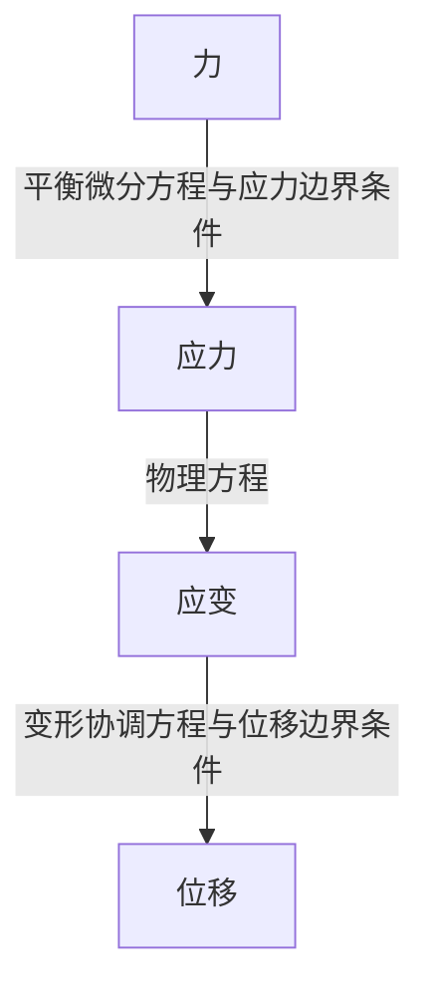

<h1>Galerkin伽辽金法引入</h1>

[toc]

# 0.导言

长久以来，我作为一个本科生在思考究竟什么是我需要追寻的？我应该以什么方式走入科研？这些问题无疑是费神费力的，直到我接触到了《计算方法》这一门课。

早在高等数学的学习中，我就思考人们如何才能计算得到没有解析式的积分。当时的想法很简单，也无非是用梯形法强行分割积分区域，然后暴力累加近似——但《计算方法》这一门课告诉我们有更好的Simpson公式、Cotes公式，乃至于奇怪但精度更高的Gauss积分法。当然数值计算不止于此，有限差分（FDM）是最为直观基础的思考方法。但随着问题维度的升高，或许引入更加丰富的求解思路会更好。

在我看来，数值求解的精髓在于“局部的线性”。当然这个表达必然是错的，但在大部分问题中似乎很管用，我也乐意用这样的想法去进行思考。

这个项目是把我当前所学的一些知识做一个整理，并程序化进行验证求解。因为课题组的要求，我无法直接接触到祖传代码，因此快马先行，早一步自己做一些尝试或许是个不错的选择。

# 1.从一个简单的问题看伽辽金法

第一次接触Galerkin法是在《弹性力学》这门课中。比较直观的想法是这样的：

1. 我们给出一个满足边界条件的位移场表达式，这个表达式是一系列基函数的线性累加，基函数分别满足边界条件；
2. 根据给出的平衡微分方程，对于每一个基函数在计算区域上的加权积分为零（这是由泛函分析，最小势能原理得到），得到一系列关于加权值的方程；
3. 求解得到加权值，他们和基函数的点积就是在当前函数表达下的最贴近真实解的位移表达式。

我向来觉得理论很抽象，需要从一个例子里体现出具体的步骤，于是我们应该考虑一个例子。

如图所示，一根长$L$的木棍，其容重为$\rho$，弹性模量为$E$，横截面积$A$。将其倒吊在天花板上，并在其底部作用一集中力$N$。这个时候请求出其位移场以及应力场，并给出木棍底端位移表达式。

显然这个问题对于学过材料力学的朋友而言应该没有任何难度，我们只需要简单地建立一个坐标系，并求出各个截面处的内力，再折算为应力，用物理方程求出应变，再将应变做积分就可以得到位移。这是基于**弹性力学**理论的基础解法。

为了验证结论，我们先根据基础的弹性理论进行求解。

由上而下建立$x$轴，位移$u$视作$x$的函数$u(x)$。从上而下在位置为$x$的地方假想地截开一刀。如下图所示：

